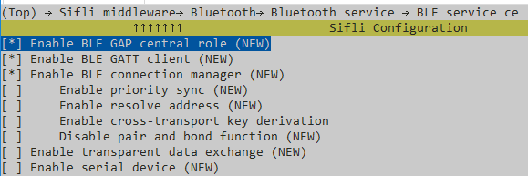

# BLE multi_connection示例

源码路径：example/ble/multi_connection

## 支持的平台
<!-- 支持哪些平台 -->
全平台

## 概述
本例程演示了本平台基于GAP central 和 peripheral和GATT server，展示了BLE多连接的示例

## 例程的使用
1. 作为从设备时开机会自动开启广播，可以通过手机的BLE APP进行连接。
2. 连接之后，板子会自动再次打开广播，可以再使用其他的手机进行连接
3. 也可以作为主设备，通过finsh命令搜索连接其他从设备

### 硬件需求
运行该例程前，需要准备：
+ 一块本例程支持的开发板([支持的平台](#Platform_peri))。
+ 手机设备。

### menuconfig配置
1. 使能蓝牙(`BLUETOOTH`)：\

2. 使能GAP, GATT Client, BLE connection manager：\

3. 使能NVDS：\


### 编译和烧录
切换到例程project/common目录，运行scons命令执行编译：
```c
> scons --board=eh-lb525 -j8
```
切换到例程`project/common/build_xx`目录，运行`uart_download.bat`，按提示选择端口即可进行下载：
```c
$ ./uart_download.bat

     Uart Download

please input the serial port num:5
```
关于编译、下载的详细步骤，请参考[快速入门](/quickstart/get-started.md)的相关介绍。

## 例程的预期结果
<!-- 说明例程运行结果，比如哪几个灯会亮，会打印哪些log，以便用户判断例程是否正常运行，运行结果可以结合代码分步骤说明 -->
例程启动后：
1. 可以被若干个不同手机，通过BLE APP搜到并连接，进行相应的GATT特质值read/write等操作。
2. 可以主动连接其他设备

## 异常诊断


## 参考文档
<!-- 对于rt_device的示例，rt-thread官网文档提供的较详细说明，可以在这里添加网页链接，例如，参考RT-Thread的[RTC文档](https://www.rt-thread.org/document/site/#/rt-thread-version/rt-thread-standard/programming-manual/device/rtc/rtc) -->

## 更新记录
|版本 |日期   |发布说明 |
|:---|:---|:---|
|0.0.1 |02/2025 |初始版本 |
| | | |
| | | |