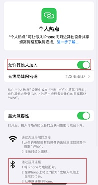
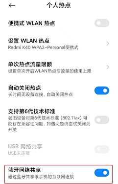
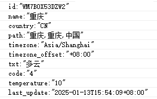
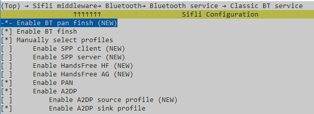
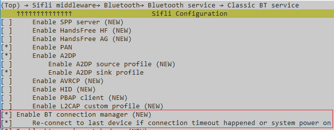

# BT PAN示例

源码路径：example/bt/pan

(Platform_pan)=
## 支持的平台
<!-- 支持哪些板子和芯片平台 -->
+ eh-lb52x
+ eh-lb56x
+ eh-lb58x

## 概述
<!-- 例程简介 -->
本例程演示通过蓝牙连接手机的PAN协议后，通过Finsh命令从特定网站获取当前天气。

##  添加 CA 证书
1. 存放签名机构根证书
- `external/mbedtls_288/certs/default` 目录中存储着常用的 CA 证书文件
- `certs` 目录下存储着用户增加的 CA 证书文件

如果 `certs/default` 目录下没有包含用户需要的 CA 根证书文件<br>
则需要用户将自己的 PEM 格式的 CA 证书拷贝 `certs` 根目录下。（仅支持 PEM 格式证书，不支持 DER 格式证书）<br>
添加证书与`DigiCert_Global_Root_CA2.crt`并列存放    


2. 证书格式说明 
- `PEM 格式证书`

    **PEM 格式证书** 通常是以 **.pem** 和 **.cer** 后缀名结尾的文件。

    使用文本编辑器打开后，文件内容以 `-----BEGIN CERTIFICATE-----` 开头，以 `-----END CERTIFICATE-----` 结尾。
- `DER 格式证书`

    **DER 格式证书** 是二进制文件类型。<br>

3. 查看配置

查看proj.conf里如果开了PKG_USING_MBEDTLS_USER_CERTS，就会把certs根目录下的所有文件都合并到ports/src/tls_certificate.c


## 例程的使用
<!-- 说明如何使用例程，比如连接哪些硬件管脚观察波形，编译和烧写可以引用相关文档。
对于rt_device的例程，还需要把本例程用到的配置开关列出来，比如PWM例程用到了PWM1，需要在onchip菜单里使能PWM1 -->
1. 连接之前最好确保手机已经打开网络共享，如果在BT连接以后才打开共享网络，可以通过finsh命令“pan_cmd conn_pan”重新连接PAN从而连接到网络
    1) IOS打开网络共享。IOS需要确保装备了SIM卡，打开个人网络热点即可：\
    
    2) 不同安卓打开网络共享的路径不同，但都是在个人热点共享里面找到蓝牙网络共享并打开。安卓可以在连接WiFi基础上打开蓝牙共享网络：\
    
2. 例程开机会打开蓝牙的Inquiry scan和psage scan，用手机等设备可以搜索到本机并发起连接，本机的蓝牙名称默认是sifli_pan。
3. 手机开启网络共享下，PAN协议才会连接成功，可以从log里面找到“pan connect successed”的打印。并且确保手机本身可以上网的情况下，
   通过输入finsh命令“weather”获取当前天气，打印成功信息如下：\
   
4. 默认本例程已开启OTA功能，输入finsh命令pan_cmd ota_pan，可以通过BT PAN下载main.c的URL指定的image并安装。关于OTA本身的介绍，见peripheral_with_ota工程

### 硬件需求
运行该例程前，需要准备：
+ 一块本例程支持的开发板([支持的平台](#Platform_pan))。
+ 手机。
+ 可以获取天气的网址(默认为api.seniverse.com)

### menuconfig配置

1. 使能蓝牙(`BLUETOOTH`)：

2. 使能PAN & A2DP，A2DP是为了避免IOS不支持单独连接PAN：

3. 使能BT connection manager：

4. 使能NVDS


### 编译和烧录
切换到例程project目录，运行scons命令执行编译：
```c
> scons --board=eh-lb525 -j32
```
切换到例程`project/build_xx`目录，运行`uart_download.bat`，按提示选择端口即可进行下载：
```c
$ ./uart_download.bat

     Uart Download

please input the serial port num:5
```
关于编译、下载的详细步骤，请参考[快速入门](/quickstart/get-started.md)的相关介绍。

## 例程的预期结果
<!-- 说明例程运行结果，比如哪几个灯会亮，会打印哪些log，以便用户判断例程是否正常运行，运行结果可以结合代码分步骤说明 -->
例程可以通过连接手机的PAN协议，获取特定网址的天气信息。

## 异常诊断


## 参考文档
<!-- 对于rt_device的示例，rt-thread官网文档提供的较详细说明，可以在这里添加网页链接，例如，参考RT-Thread的[RTC文档](https://www.rt-thread.org/document/site/#/rt-thread-version/rt-thread-standard/programming-manual/device/rtc/rtc) -->

## 更新记录
|版本 |日期   |发布说明 |
|:---|:---|:---|
|0.0.1 |01/2025 |初始版本 |
|0.0.2 |04/2025 |增加OTA |
|0.0.3 |07/2025 |增加CA证书 |
| | | |
