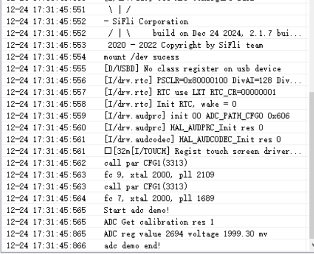
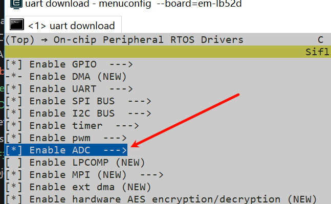

# ADC_battery示例
源码路径：example/hal/adc/adc_battery
## 支持的平台
例程可以运行在以下开发板
* sf32lb52-lcd_n16r8

## 概述
* 操作Hal函数单路ADC读取电池电压

## 例程的使用
### 编译和烧录
演示代码默认为单路ADC采样演示

切换到例程project目录，运行scons命令执行编译：

```
scons --board=sf32lb52-lcd_n16r8 -j8
```

执行烧写命令
```
build_sf32lb52-lcd_n16r8_hcpu\uart_download.bat
```

按提示选择端口即可进行下载：

```none
please input the serial port num:5
```

#### 例程输出结果展示:
* 接入电池前读取的电压log


* 接入电池后读取的电压log



log中打印value值原始寄存器值，Voltage是转换后的mV电压


#### ADC配置流程

* 设置电池Vbat接口对应的通道7


* 在menuconfig中打开adc device

```
menuconfig --board=sf32lb52-lcd_n16r8
```



**注意**: 
* 打开对应的ADC的时钟源（默认代码开启，此处不是必须）
```c
/* 2, open adc clock source  */
HAL_RCC_EnableModule(RCC_MOD_GPADC);
```

* ADC校准
1. 为了提高ADC精度，SiFli系列芯片出厂都进行了ADC校准（校准参数写入了芯片内的OTP区域），不同系列校准方法会有区别，  
为了确保ADC精确度，每次上电，需要调用一次，如下是校准函数，该校准函数会通过读取OTP的参数，计算出斜率`adc_vol_ratio`和偏移量`adc_vol_offset`

```c
static int utest_adc_calib(void)
```
2. ADC采用得到寄存器原始值后，调用函数`example_adc_get_float_mv`并根据校验得到的斜率`adc_vol_ratio`和偏移量`adc_vol_offset`算出最终的电压值
3. 52系列芯片 CH8(Channel 7)内部通过2个相等的电阻分压后,连接到Vbat,要得到Vbat值,需要通过换算得到,为了减少分压电阻的误差,出厂已经对两颗电阻进行了校准,
```c
static float adc_vbat_factor = 2.01; /* 校准52芯片内部CH8(Channel 7)内部两到Vbat的两个分压电阻 */
static void example_adc_vbat_fact_calib(uint32_t voltage, uint32_t reg)
{
    float vol_from_reg;

    // get voltage calculate by register data
    vol_from_reg = (reg - adc_vol_offset) * adc_vol_ratio / ADC_RATIO_ACCURATE;
    adc_vbat_factor = (float)voltage / vol_from_reg;
}
/* 采样CH8(Channel 7) 换算为Vbat电压值方法,参考 sifli_get_adc_value函数内代码 */
    float fval = sifli_adc_get_float_mv(fave) * 10; // mv to 0.1mv based
    *value = (rt_uint32_t)fval;
    if (channel == 7)   // for 52x, channel fix used for vbat with 1/2 update(need calibrate)
        *value = (rt_uint32_t)(fval * adc_vbat_factor); /* 采样的实际ADC电压,换算为Vbat电压值*/
```
## 异常诊断
* ADC采样的电压值不对
1. 检查ADC硬件是否连接正确，ADC采样的通道为固定IO口，不能任意指定，具体CH0-7为哪个IO，参照芯片手册  
2. ADC输入电压范围为0V - 参考电压（52默认为3v3），不能超出输入范围  
3. 采用Ozone或者LightWork等调试工具，在启动ADC采样后，在线连接，对照芯片手册，查看对应的寄存器配置状态
* ADC精确度不够
1. ADC校准参数是否获取和使用
2. 分压电阻的精度是否达到要求
3. ADC参考电压是否稳定和是否有过大纹波(具体参考ADC电压参考芯片手册) 

  
## 参考文档
* EH-SF32LB52X_Pin_config_V1.3.0_20231110.xlsx
* DS0052-SF32LB52x-芯片技术规格书 V0p3.pdf
## 更新记录
|版本 |日期   |发布说明 |
|:---|:---|:---|
|0.0.1 |10/2024 |初始版本 |
| | | |