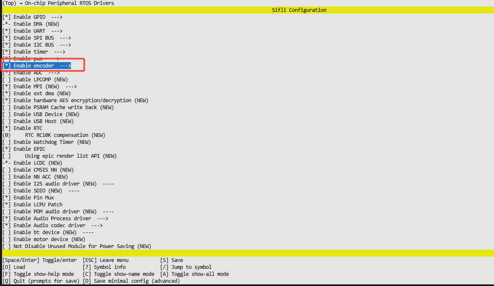

# pulse_encoder示例

源码路径：example\rt_device\pulse_encoder
## 支持的平台
例程可以运行在以下开发板.
* sf32lb52-lcd_n16r8
## 概述
* 脉冲编码器能够精确地测量旋转轴的位置。每转动一定角度，编码器就会生成一个脉冲信号。通过计算这些脉冲的数量，可以确定旋转轴的当前位置。
* GPtimerd的encoder模式让外部脉冲编码器控制定时器的CNT增减示例
* 支持多个编码器使用

## 例程的使用
### 硬件需求
运行该例程前，需要准备一块本例程支持的开发板


### menuconfig配置



## 例程的使用
### 编译和烧录
切换到例程project目录，运行scons命令执行编译：

> scons --board=sf32lb52-lcd_n16r8 -j8

切换到例程`project/build_xx`目录，运行`download.bat`


> build_sf32lb52-lcd_n16r8_hcpu\download.bat


关于编译、下载的详细步骤，请参考[快速上手](quick_start)的相关介绍。
### 每秒读取GPtimer被外接设备控制cnt增减下的值
#### 例程输出结果展示:
* log输出:
```
encoder_example_init!
succeed encoder_example_init
Start Get_count!
encoder1_count:0
encoder2_count:2
encoder1_count:5
encoder2_count:6
msh />
```
* 本例程使用轮询方式每秒读取cnt值

#### encoder的通道选择参数修改

|版型名称  | GPTIMx_CHx   | 引脚(物理位置)     |    
|--------|---------------|-------------------|
|525:     |               |                   |   
|        | GPTIM1_CH1    | PAD_PA27          |   
|        | GPTIM1_CH2    | PAD_PA20          |   
|        | GPTIM2_CH1    | PAD_PA37          | 
|        | GPTIM2_CH2    | PAD_PA38          | 
|587：   |               |                   |
|        | GPTIM1_CH1    |PAD_PA82 （CONN2 22）  |
|        | GPTIM1_CH2    |PAD_PA51 （CONN2 28）  |


```c
//52为例打开多个encoder设备
#ifdef SF32LB52X    
    HAL_PIN_Set(PAD_PA37, GPTIM2_CH1, PIN_PULLUP, 1);
    HAL_PIN_Set(PAD_PA38, GPTIM2_CH2, PIN_PULLUP, 1);

    HAL_PIN_Set(PAD_PA27, GPTIM1_CH1, PIN_PULLUP, 1);
    HAL_PIN_Set(PAD_PA20, GPTIM1_CH2, PIN_PULLUP, 1);

#elif defined SF32LB58X
    HAL_PIN_Set(PAD_PA82, GPTIM1_CH1, PIN_PULLUP, 1);
    HAL_PIN_Set(PAD_PA51, GPTIM1_CH2, PIN_PULLUP, 1);
#endif


//GTIM设备命名是:encoder（number） 
//ATIM设备命名：Aencoder（number）
#define ENCODER_DEVICE_NAME1 "encoder1"
#define ENCODER_DEVICE_NAME2 "encoder2"


encoder_device1 = rt_device_find(ENCODER_DEVICE_NAME1);
encoder_device2 = rt_device_find(ENCODER_DEVICE_NAME2);

//PULSE_ENCODER_CMD_ENABLE使能
result1 = rt_device_control((struct rt_device *)encoder_device1, PULSE_ENCODER_CMD_ENABLE, (void *)&config1);
result2 = rt_device_control((struct rt_device *)encoder_device2, PULSE_ENCODER_CMD_ENABLE, (void *)&config2);

//PULSE_ENCODER_CMD_GET_COUNT：获取当前计数值
result1 = rt_device_control((struct rt_device *)encoder_device1, PULSE_ENCODER_CMD_GET_COUNT, (void *)&config_count1);
result2 = rt_device_control((struct rt_device *)encoder_device2, PULSE_ENCODER_CMD_GET_COUNT, (void *)&config_count2);


```
**注意**: 
1. 52x芯片,可以配置到任意带有PA_TIM功能的IO作为encoder通道使用
2.  HAL_PIN_Set 最后一个参数为hcpu/lcpu选择, 1:选择hcpu,0:选择lcpu ，不同定时器配置不同，hcpu/lcpu选择不同！，具体参考encoder_config.h文件


## 异常诊断
如果未能出现预期的log和旋转无法增减cnt，可以从以下方面进行故障排除：
* 硬件连接是否正常
* 管脚配置是否正确 


## 参考文档
- 对于rt_device的示例，rt-thread官网文档提供的较详细说明，可以在这里添加网页链接，例如，参考RT-Thread的[RTC文档](https://www.rt-thread.org/document/site/#/rt-thread-version/rt-thread-standard/programming-manual/device/rtc/rtc)

## 更新记录
|版本 |日期   |发布说明 |
|:---|:---|:---|
|0.0.1 |10/2024 |初始版本 |
|0.0.2 | 12/2024| 2.0|
| | | |
```